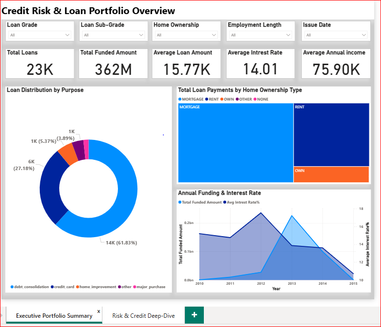
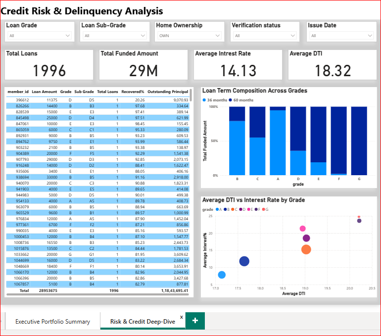

# Strategic Credit Risk & Loan Portfolio Intelligence

## Executive Summary
Developed a comprehensive Power BI Business Intelligence Suite to analyze a loan portfolio containing over 23,000 records and $362M in total funding. The project is split into two distinct analytical views to serve different organizational stakeholders, focusing on the trade-off between loan volume and credit risk.

## Dashboard Architecture
### Page 1: Executive Portfolio Summary
**Objective**: High-level monitoring of business health, growth trends, and borrower demographics.
**Target Audience**: C-Suite Executives and Portfolio Managers.
#### Key Insights:
**Market Share**: Analyzed loan distribution by purpose, identifying Debt Consolidation as the primary driver (61.8%).
**Growth Trends**: Monitored annual funding cycles vs. interest rate fluctuations to assess market competitiveness.
**Stability Metrics**: Segmented total payments by Home Ownership (Mortgage vs. Rent) to evaluate borrower collateral patterns.
### Dashboard Architecture

### Page 2: Risk & Credit Deep-Dive
**Objective**: Granular analysis of delinquency, default patterns, and risk-adjusted pricing.
**Target Audience**: Credit Analysts and Risk Officers.
#### Key Insights:
**The "Danger Zone**: Utilized a Scatter Plot to identify high-risk outliers by correlating Debt-to-Income (DTI) ratios with Interest Rates across different loan grades.
**Term Concentration**: Visualized the shift in loan terms using 100% Stacked Column Charts, highlighting that lower-grade loans (E, F, G) are heavily concentrated in 60-month terms.
**Operational Recovery**: Tracked recovery rates and outstanding principal at an individual member level for actionable collections strategy.
### Dashboard Architecture

## Technical Skills Demonstrated
**Data Modeling**: Implementation of a clean star schema for optimized query performance.
**Advanced DAX**: Authored complex measures including Default Rate %, Loss Severity, and Average Annual Income to provide deeper financial context.
**UI/UX Design**: Built a multi-page navigation experience with synced slicers and a consistent professional design theme.
**Analytical Reasoning**: Applied grouping and "Top N" filtering to declutter complex categorical data (e.g., Loan Purpose).
